# PyQt examples 2022

These PyQt examples show you how to create a desktop app with Python and Qt. Start with "Hello World" or browse the official PyQt demos. You can run every example yourself on Windows, Mac or Linux. All you need is Python 3. For instructions, please see [below](#running-the-examples).

| <a href="01 PyQt QLabel">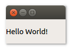</a> | <a href="02 PyQt Widgets"></a> | <a href="03 QVBoxLayout PyQt6">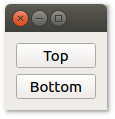</a> | <a href="04 PyQt Signals and Slots">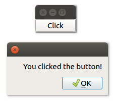</a> | <a href="05 Qt Designer Python">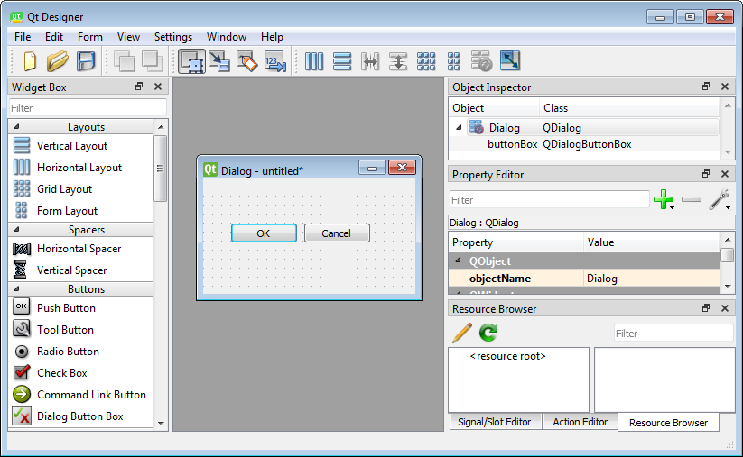</a> |
| :--: | :--: | :--: | :--: | :--: |
| <a href="01 PyQt QLabel">Hello World!</a> | <a href="02 PyQt Widgets">Common PyQt Widgets</a> | <a href="03 QVBoxLayout PyQt6">Layouts</a> | <a href="04 PyQt Signals and Slots">Signals and Slots</a> | <a href="05 Qt Designer Python">Qt Designer & Python</a> |

| <a href="06 QML Python example">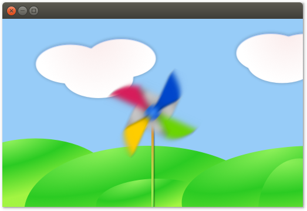</a> | <a href="07 Qt Text Editor">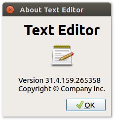</a> | <a href="08 PyQt6 exe">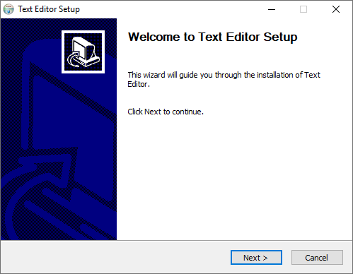</a> | <a href="09 Qt dark theme">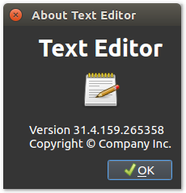</a> |
| :--: | :--: | :--: | :--: |
| <a href="06 QML Python example">QML Python example</a> | <a href="07 Qt Text Editor">Qt Text Editor</a> | <a href="08 PyQt6 exe">Packaging & deployment</a> | <a href="09 Qt dark theme">Qt Dark Theme</a> |

| <a href="10 QPainter Python example">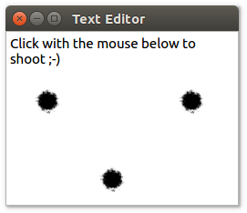</a> | <a href="11 PyQt Thread example">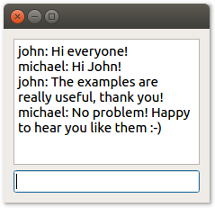</a> | <a href="12 QTreeView example in Python">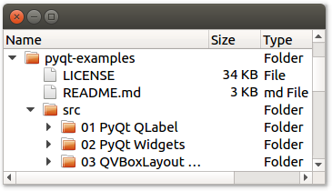</a> | <a href="13 PyQt6 QListView">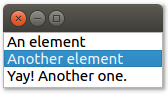</a> |
| :--: | :--: | :--: | :--: |
| <a href="10 QPainter Python example">Action Shooter</a> | <a href="11 PyQt Thread example">Chat Client</a> | <a href="12 QTreeView example in Python">Tree Views</a> | <a href="13 PyQt6 QListView">Lists</a> |

| <a href="14 QAbstractTableModel example"></a> | <a href="15 PyQt database example">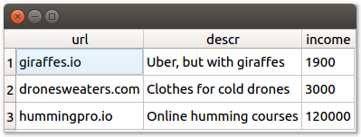</a> |
| :--: | :--: |
| <a href="14 QAbstractTableModel example">Custom Tables</a> |  <a href="15 PyQt database example">PyQt database example</a> |

These examples are taken from the following book:

<p align="center">
    <a href="https://build-system.fman.io/pyqt6-book"></a>
    <br/>
    <a href="https://build-system.fman.io/pyqt6-book">Python and Qt: The Best Parts</a>
    <br/>
    by Michael Herrmann
</p>

## Official PyQt demos

The [PyQt source archive](https://www.riverbankcomputing.com/software/pyqt/download5) also contains a large number of sample files. You can find them reproduced here in the [`pyqt-official`](pyqt-official) directory. The easiest way to start them is to follow the [instructions about running examples](#running-the-examples) below, then execute the following commands:

    cd pyqt-official/qtdemo
    python qtdemo.py

This starts the PyQt example launcher:

<p align="center"></p>

You can use it to easily browse and run the official demo applications. The following examples are quite nice for instance:

 * Quick / Animation / ColorAnimation
 * Graphics Effects / Lighting and Shadows
 * Desktop / System Tray
 * Desktop / Screenshot
 * Widgets / Tetrix

## Running the examples

Running the examples is really easy. The only thing you need is [Python 3](https://www.python.org/downloads/).

First, download the [ZIP archive of this repository](https://github.com/pyqt/examples/archive/_.zip) and unpack it. Open a command prompt and use `cd` to navigate into the top-level directory of the archive.

Create a virtual environment via the command:

    python3 -m venv venv

This creates the folder `venv/` in your current directory. It will contain the necessary libraries for running the examples.

To activate the virtual environment, use the following command:

```
# On Windows:
call venv\Scripts\activate.bat
# On Mac / Linux:
source venv/bin/activate
```

Now execute the following to install the necessary dependencies:

    pip install -Ur requirements.txt

Once you have done this, use `cd` to navigate to the example you're interested in in the [``](src) folder. For example:

    cd "01 PyQt QLabel"

You'll find a `.py` file there, typically `main.py`. You can run it with the command:

    python main.py

Please note that the virtual environment must still be active for this to work.

## Using PySide

This repository uses PyQt6 to use Qt from Python. Another, alternative binding is PySide6 (also called "Qt for Python"). It is less mature than PyQt6 but has the advantage that you can use it for free in commercial projects.

If you want to use PySide6 instead of PyQt6, simply replace all mentions of the latter by the former. For instance, in [`requirements.txt`](requirements.txt), replace `PyQt6` by `PySide6`. Similarly for any code examples: `from PyQt6.QtWidgets ...` becomes `from PySide6.QtWidgets ...` etc.

Alternatively, if you don't want to commit to either of the two bindings at this stage, you can also use [Qt.py](https://github.com/mottosso/Qt.py). This is an abstraction over PySide6 and PyQt6. It loads whichever of the two bindings is available. To use it for the examples presented here, replace all mentions of `PyQt6` by just `Qt`.

## Licensing

Except where otherwise indicated, you may use the source code of examples 1 - 15 in the [`` directory](src) under the terms of the MIT or GPLv3 licenses.

The official PyQt demos in [`pyqt-official`](pyqt-official) are [licensed under the GPL](pyqt-official/LICENSE).

The screenshots in this repository may be used under the terms of the [CC BY-NC-SA 4.0](https://creativecommons.org/licenses/by-nc-sa/4.0/) if you prominently mention and link to [Michael Herrmann's PyQt6 book](https://build-system.fman.io/pyqt6-book). 
